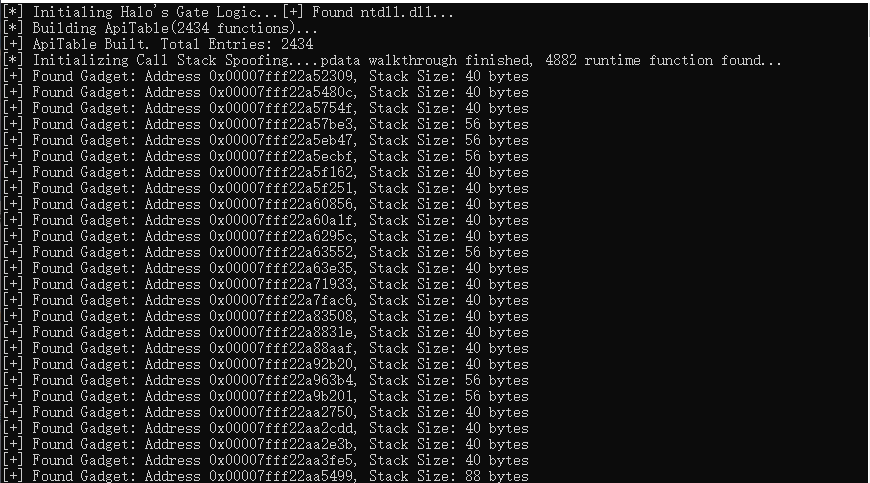
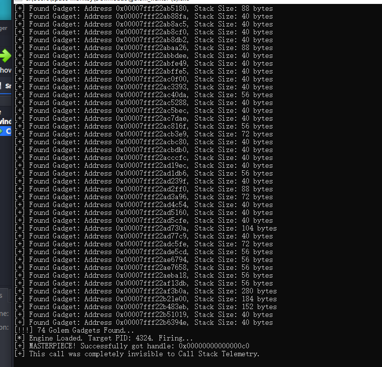

# What is and Why Call Stack Spoofing?
不同于Halo's Gate是一种具体的技术，Call Stack Spooing是一个结果，或者说一个目标。他针对的是EDR检测系统的Stack Telemetry技术。当我们通过Halo's Gate绕过了EDR在ntdll.dll中的用户态Hook，直接发起了系统调用，我们解决了怎么开枪的问题。开枪的人以及开枪的地点仍然直接暴露在EDR面前：

EDR会回溯检查syscall的发出地方，如果来自非法内存区域比如我们程序中自带的汇编而不是合法常见的ntdll.dll，他会马上封锁并杀死程序。针对这一点我们使用了一个非常简单的思路：indirect syscall，这是原本Halo's Gate逻辑的完美延伸：我们通过提取ntdll.dll中函数自带的syscall, ret指令的地址，在汇编中只需要jmp就可以让他来帮我们开枪，这样开枪的人的问题就解决了。

但是EDR还会检查调用栈，indirect syscall只是隐蔽了最后扣动扳机这个动作，但我们的调用栈仍然被完整的暴露，因此我们需要在进行syscall之前，插进去一个看起来合法的调用栈，这个动作就叫做Call Stack Spoofing。

# The Path

正如上面所说，Call Stack Spoofing并非一种特定技术，他是一个动作，一个结果，有多种实现径：

其中最简单，也最经典的就是ROP Chain, 既然我们已经通过遍历拿到了ntdll.dll以及kernel32.dll...的地址，我们可以通过暴力搜索提取Gadget指令，比如：add rsp, X; ret。通过将这些指令拼接到syscall之前，因为这些指令指向当前进程空间内已映射的合法代码段，自然而然的就实现了Call Stack Spoofing。虽然简单，这个方法存在巨大的不确定性，x64的系统有着严格的栈对齐要求（16字节），而零散的Gadget拼接非常容易摧毁整个栈的结构。虽然ROP Chain很好玩，这并不是成熟的选择。

我的实现路径：
我们将放弃不稳定的 **ROP Gadgets**（代码片段），转而采用**基于 `.pdata` 的本地栈帧合成方案**。其核心思想是：不只是“切断”异常调用链，而是手动“编织”一个看起来完全合法的调用序列。
#### 1. 本地模块搜寻 (Local Reconnaissance)
- **动作**：通过 **PEB** (Process Environment Block，进程环境块) 遍历 **Ldr** (Loader Data，加载器数据) 链表。
- **目标**：获取 `ntdll.dll` 或 `kernel32.dll` 在本进程中的 **Base Address** (基地址)。
- **Why**：这是所有后续解析的起点，确保我们操作的是本进程内存，无需复杂的跨进程权限。
#### 2. 解析异常目录 (Exception Directory Navigation)
- **动作**：解析 **PE Header** (PE 文件头)，定位 **DataDirectory** (数据目录) 的第 4 个条目（索引为 3）。
- **目标**：找到 **.pdata** 段的起始地址。
- **Why**：**.pdata** 存储了所有非叶子函数的 **Unwind Info** (回溯信息)，这是构建 **Synthetic Frame** 的“说明书”。（叶子函数大多没有完整栈帧，因为他们不需要储存执行状态，通过寄存器执行完成直接返回数据）
#### 3. 筛选“黄金函数” (Golden Function Selection)
- **动作**：遍历 `IMAGE_RUNTIME_FUNCTION_ENTRY` 数组，寻找满足条件的函数。
- **条件**：
    1. **Legitimacy** (合法性)：是系统 DLL 的导出函数。
    2. **Simple Unwind** (简单回溯)：没有复杂的嵌套处理，具有标准的 **Stack Size** (栈大小)。
- **Why**：我们要借用这些函数的身份。我们需要知道它们在执行时，栈会长什么样，以便我们完美复刻。
#### 4. 栈指针切换与伪造 (Stack Pivoting & Synthesis)
- **动作**：通过汇编代码保存真实的 **RSP** (Stack Pointer，栈指针寄存器)，并将其指向我们预先准备好的“假栈”。
- **目标**：在假栈中，按照步骤 3 找到的函数模板，依次压入：
    1. 伪造的返回地址（指向合法函数的 `add rsp, X; ret` 之后）。
    2. 构造好的 **Context** (上下文)。
- **Punchline (关键点)**：我们要让栈看起来像是从 `BaseThreadInitThunk` 正常调用下来的。
#### 5. 间接系统调用 (The Final Indirect Syscall)
- **动作**：将 **SSN** (System Service Number，系统服务号) 放入 `RAX`，并 `jmp` 到 `ntdll` 里的 `syscall; ret` 指令。    
- **结果**：当 EDR 拦截并回溯栈时，它会发现：
    - **RIP** 指向 `ntdll`（合法）。
    - **Call Stack** 完整且符合 `.pdata` 定义（合法）。
    - **Entry Point** 溯源至线程启动函数（合法）。

# Let's Do It !
(内容延续之前Halo's Gate的代码，不过我做了模块化的整理)
我在spoof.c中定义了第一个函数：
```
PVOID getRuntimeFunctionEntry(PVOID dllBase, PDWORD pOutFunctionCount){

// 将基址转化为单字节指针，这是后续所有 RVA 计算的“尺子”
PBYTE pBase = (PBYTE)dllBase;

// 强转获取 DOS 头
PIMAGE_DOS_HEADER pDosHeader = (PIMAGE_DOS_HEADER)pBase;
if(pDosHeader->e_magic != IMAGE_DOS_SIGNATURE){
return NULL;
}

//利用Dos里面的e_lfanew偏移跳转到Nt header
PIMAGE_NT_HEADERS pNtHeaders = (PIMAGE_NT_HEADERS)(pBase + pDosHeader->e_lfanew);
if(pNtHeaders->Signature != IMAGE_NT_SIGNATURE){
return NULL;
}

// 提取异常目录的 RVA
DWORD exceptionRva = pNtHeaders>OptionalHeader.DataDirectory[IMAGE_DIRECTORY_ENTRY_EXCEPTION].VirtualAddress;

// 提取异常目录的总大小
DWORD exceptionSize = pNtHeaders>OptionalHeader.DataDirectory[IMAGE_DIRECTORY_ENTRY_EXCEPTION].Size;

  

// 强转为 RUNTIME_FUNCTION 指针数组
PIMAGE_RUNTIME_FUNCTION_ENTRY pRuntimeFuncs = (PIMAGE_RUNTIME_FUNCTION_ENTRY)(pBase + exceptionRva);

// 计算数组里到底有多少个函数条目
DWORD functionCount = exceptionSize / sizeof(IMAGE_RUNTIME_FUNCTION_ENTRY);
*pOutFunctionCount = functionCount;

printf(".pdata walkthrough finished, %d runtime function found...", functionCount);

return pRuntimeFuncs;

}
```
这个函数会返回异常目录的地址以及所包含的函数数量。

接下来我们要手动解析这个异常目录，逻辑会比较复杂，详见spoof.h, spoof.c。
我们来看运行结果：

是不是很漂亮，我们提取了76个合格干净的Gadget。

然后我们改进汇编，并融合之前调用NtOpenProcess的逻辑：详见main.c, gate.s
效果如下：
